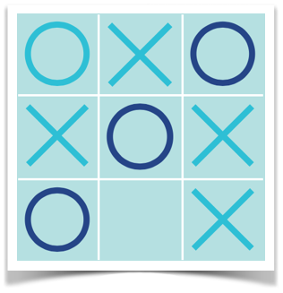

Introducción
============
Este proyecto es una prueba de concepto del juego de 3 en línea (Tic-Tac-Toe), como una aplicación web en la que el usuario juega contra el ordenador. La implementación del juego tiene 2 partes:

* El módulo cliente implementado en **Angular 2** y TypeScript
* Un **servicio RESTful** que representa al oponente del usuario

Puesta en marcha
================
El proyecto fue creado con Angular Cli v1.0.0-beta.19-3

Para poner en marcha el servidor de desarrollo:

	ng serve

Para ejeuctar las pruebas unitarias:

	ng test

Para preparar los ficheros de despliegue:

	ng build

